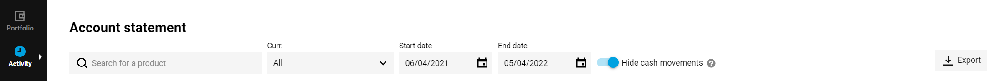
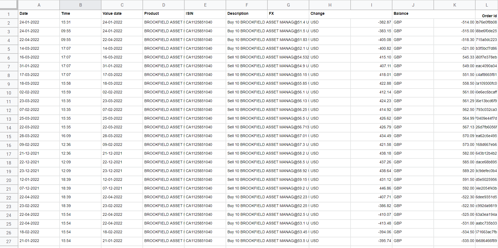
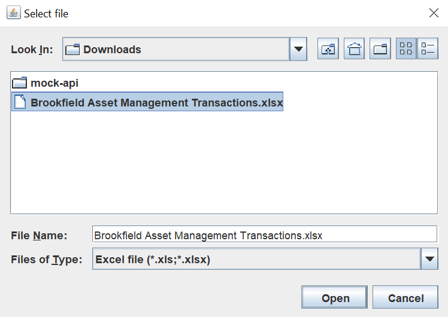

# HMRC Capital Gains Transaction Calculator For DEGIRO
An application to help report stock transactions for an HMRC Capital Gains tax report.

This application is designed for stock transactions completed using the broker DEGIRO.

This application is for personal use only.
This application is not authorised by, or affiliated with, HMRC or DEGIRO.

This application's output is for reference purposes only. Use at your own discretion.
The accuracy of the application's output cannot be guaranteed, and the developer accepts no responsibility for the use of the application's output in any circumstances, including tax returns.

## Technical specifications

Kotlin v1.6.21
Java v17.0.2
Maven framework build

IntelliJ IDEA 2021.3.3 (Community Edition)
Build #IC-213.7172.25, built on March 15, 2022
Runtime version: 11.0.14.1+1-b1751.46 amd64
VM: OpenJDK 64-Bit Server VM by JetBrains s.r.o.
Windows 10 10.0
GC: G1 Young Generation, G1 Old Generation
Memory: 1014M
Cores: 4
Non-Bundled Plugins:
org.jetbrains.kotlin (213-1.6.21-release-334-IJ6777.52)

Kotlin: 213-1.6.21-release-334-IJ6777.52

## Instructions

1. Log in to your DEGIRO account, then navigate through **Activity** > **Account statement**
2. Modify the start and end dates as desired. **N.B. While the tax year ends on April 5th, you may need to factor in purchases made 30 days after April 5th because of the Bed and Breakfast capital gains rule. For example, if you sell shares in Company A on April 1st then buy shares in Company A on April 10th, the sold shares may be matched with the purchased shares, even if the purchase occurred in the following tax year (so long as the purchase occurs within 30 days after the sale). For more information, research the Bed and Breakfast HMRC capital gains rule.**
3. Press Export then XLS to download a spreadsheet containing all the transactions in your selected timeframe.

4. The transactions must be processed on a stock-by-stock basis. Copy all transactions for a given stock into a separate spreadsheet.
5. The only rows that should be included are those with a description beginning "Buy ..." or "Sell ..." **N.B. All buy and sell transactions must be priced in GBP. For transactions in other currencies, you should replace the value in the Change field with the GBP value as determined by DEGIRO when the transaction occured. The GBP value can be found by searching the spreadsheet for the FX Debit record (for Buy transactions) or FX Credit record (for Sell transactions) associated with the transaction.**
6. Delete all other rows, including column headers, transaction fees, dividends etc.

**N.B. The column header row is included in the below screenshot for illustrative purposes. You should remove the column header row from your spreadsheet.**

7. Run the application in an IDE such as IntelliJ. Note you may need to install the application using Maven to acquire the requisite dependencies. You may also need to specify that the application will run using Java 17 and Kotlin 1.6.21 (full technical specifications are provided above).
8. A file chooser dialog should open. Navigate to, and select, the spreadsheet file containing the buy and sell transactions for your chosen stock. **N.B. The spreadsheet must have a file extension of .xls or .xlsx**

